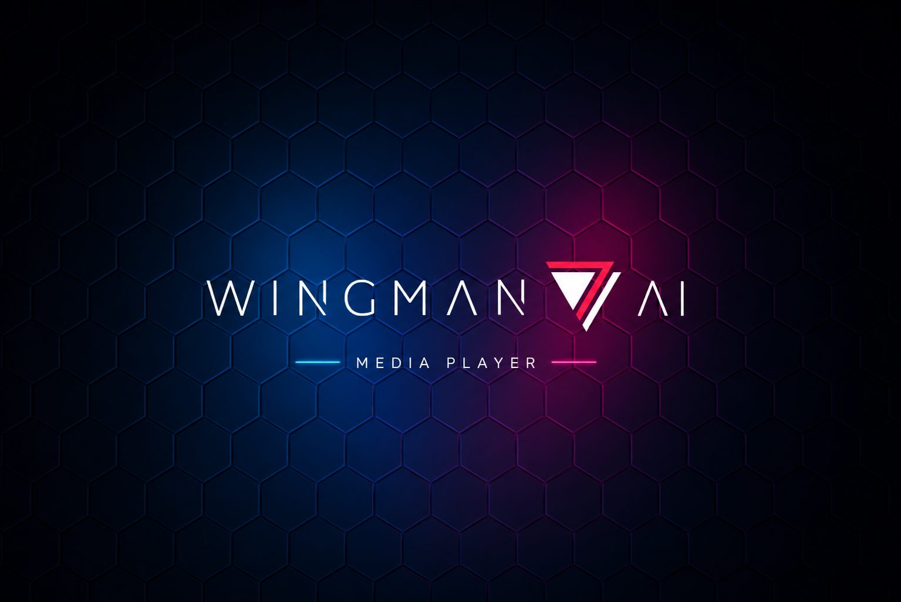

<p align="center">
  
</p>

<p align="center">
  
  
  
</p>

---

**Wingman Player** is an always-on-top Windows overlay that runs a YouTube player inside a sci-fi frame at the edge of your screen. The player is driven by the Wingman YouTube skill — call `window.__wingmanLoad(videoId, playlistId)` from the host to load any video or playlist into the overlay.

---

## Features

- **Sci-fi overlay frame** — Transparent, always-on-top window with a 16:9 video cutout
- **Adjustable opacity** — Fade the overlay to any level without losing interactivity
- **Resizable window** — Scale from 30% to 100%
- **Draggable frame** — Reposition by dragging the frame border
- **Position memory** — Remembers where you left it between sessions
- **Configurable hotkey** — Toggle the overlay with any key combination (default **F8**)
- **Lock mode** — Lock in place to prevent accidental repositioning
- **Mini banner** — Compact "now playing" tile when the overlay is hidden
- **OBS streaming support** — Frame is capturable via OBS Window Capture (WGC); audio is exposed as a dedicated localhost stream (`http://127.0.0.1:17329/stream.wav`) consumed by OBS Media Source. No third-party audio routing required, no doubled local audio
- **Auto-update** — Checks GitHub Releases on launch and offers an in-place update; manual *Check for updates* button in Settings

---

## Requirements

- Windows 10 or 11 (64-bit)
- [.NET 9 Desktop Runtime](https://dotnet.microsoft.com/en-us/download/dotnet/9.0)
- [Microsoft Edge WebView2 Runtime](https://developer.microsoft.com/en-us/microsoft-edge/webview2/) *(pre-installed on most Windows 11 machines)*
- An active internet connection (streams from YouTube)

---

## Installation

Two download options on the [Releases page](https://github.com/Diftic/Wingman-Player/releases):

- **`Wingman-Player-Setup.msi`** — Per-user installer. Adds a Start Menu shortcut and wires up auto-update. Recommended.
- **`Wingman-Player.exe`** — Standalone launcher. Run it directly from any folder, no installation.

Default toggle hotkey is **F8**.

> Settings are stored in `%APPDATA%\wingman_player\`. Uninstalling the MSI leaves your settings behind; delete the folder manually if you want a clean slate.

---

## Usage

| Action | How |
|--------|-----|
| Show / hide overlay | Default hotkey: **F8**, or right-click the tray icon |
| Move the window | Drag any part of the frame border |
| Resize | **Settings Menu** → `−10%` / `+10%` size buttons |
| Change opacity | **Settings Menu** → opacity slider |
| Change toggle hotkey | **Settings Menu** → hotkey field → press your combo |
| Lock position | **Settings Menu** → **Lock / Unlock** |
| Choose minimize behaviour (tray / banner) | **Settings Menu** → minimize mode |
| Reposition / lock the mini banner | **Settings Menu** → **Miniplayer Settings** |
| Configure OBS streaming | **Settings Menu** → **Streamer Info** *(walkthrough + Copy URL button)* |
| Check for updates manually | **Settings Menu** → **vX.Y.Z · Check for updates** |
| Exit | Right-click tray icon → **Exit** |

---

## Architecture

Wingman Player is a **.NET 9 WPF** application. All visual elements — the sci-fi frame, settings panel, embedded YouTube player — live inside a **WebView2** (Chromium) instance rendered as HTML/CSS/JS. This sidesteps the WPF airspace problem where WebView2's HWND would otherwise always render above WPF visuals, making a native frame impossible.

### Key Components

| Component | Location | Purpose |
|-----------|----------|---------|
| Overlay window | `src/UI/OverlayWindow.xaml.cs` | WPF host, hotkeys, drag engine, tray icon |
| Mini banner window | `src/UI/MiniBannerWindow.xaml.cs` | Compact "Now Playing" banner shown while overlay is hidden |
| Renderer | `src/Renderer/` | HTML/CSS/JS UI — frame, settings, embedded YouTube player |
| Player controller | `src/Renderer/player.js` | YouTube IFrame API, settings bridge to C#, exposes `window.__wingmanLoad` |
| Audio bridge | `src/Services/AudioBridge.cs` | WASAPI process-loopback capture from WebView2; forwards PCM to `LocalAudioStreamServer` |
| Stream server | `src/Services/LocalAudioStreamServer.cs` | Loopback HTTP server exposing captured PCM as endless WAV at `http://127.0.0.1:17329/stream.wav` |
| Update checker | `src/Services/UpdateChecker.cs` | Polls GitHub Releases for a newer version |
| Self-update service | `src/Services/SelfUpdateService.cs` | Downloads the new exe / MSI, swaps in place, restarts |
| Constants | `src/Constants.cs` | Frame dimensions, default values |
| Settings model | `src/Models/WingmanPlayerSettings.cs` | Persisted user preferences (JSON) |

### How It Works

**Wingman skill entry point.** The host loads media into the player by calling `window.__wingmanLoad(videoId, playlistId)` via `CoreWebView2.ExecuteScriptAsync`. Pass `(null, null)` to return to the idle state.

**Virtual host.** The renderer is served over `https://wingman.local/` via WebView2's `SetVirtualHostNameToFolderMapping`. This satisfies the YouTube IFrame API's HTTPS requirement without needing a real web server.

**Drag system.** JavaScript detects `mousedown` on non-interactive frame areas and sends a `startDrag` message to C# via `window.chrome.webview.postMessage`. A `WH_MOUSE_LL` low-level mouse hook handles `MOUSEMOVE` and `LBUTTONUP` to move the window. The hook is only installed while the overlay is visible — zero system-wide impact when hidden.

**Zoom.** The `ApplyZoom` method resizes the WPF window proportionally and sets `WebView.ZoomFactor` in the same call. CSS zoom is not used — this ensures correct hit areas and no visual blink at all zoom levels.

**Settings bridge.** JS posts JSON messages to C# (`{ type: 'opacity', value: 0.8 }`, `{ type: 'zoom', pct: 80 }`, etc.). C# handles each message type in `WebMessageReceived`.

---

## Building from Source

```bash
git clone https://github.com/Diftic/Wingman-Player.git
cd Wingman-Player
dotnet build src/wingman_player.csproj
dotnet run --project src/wingman_player.csproj
```

Requires the [.NET 9 SDK](https://dotnet.microsoft.com/en-us/download/dotnet/9.0).

---

## License

This project is released under the [MIT License](LICENSE).
